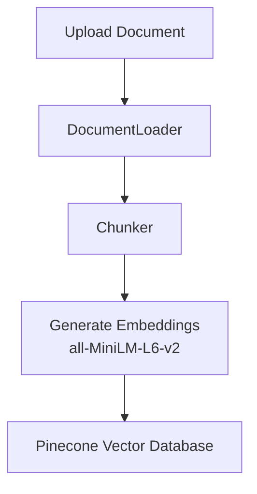
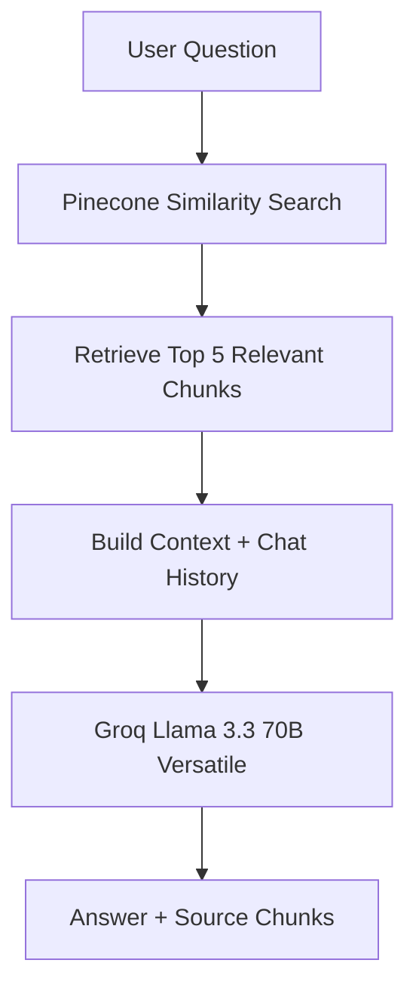

# Enterprise RAG Chatbot using LangChain, Pinecone & Groq

## Overview

The **Enterprise RAG Chatbot** is a LangChain-based Retrieval-Augmented Generation (RAG) application that enables users to upload enterprise documents and interact with them using natural language. The application processes uploaded documents, generates semantic embeddings, stores them in Pinecone, and retrieves the most relevant information to generate accurate, context-aware responses using Groq's **Llama 3.3 70B Versatile** model.

The project follows a modular architecture with separate components for document ingestion, chunking, embeddings, vector storage, retrieval, and response generation.

---

## Features

- LangChain-based modular RAG architecture
- Upload and process **PDF, DOCX, TXT, Excel, and image** files
- OCR support using **Tesseract OCR** for image-based documents
- Recursive text chunking for efficient retrieval
- Semantic embeddings using **sentence-transformers/all-MiniLM-L6-v2**
- Pinecone vector database integration
- Context-aware answer generation using **Groq Llama 3.3 70B Versatile**
- Source-grounded responses with retrieved document chunks
- Configurable chunking and retrieval parameters
- Streamlit-based user interface

---

## System Architecture

### Document Ingestion Pipeline



---

### Question Answering Pipeline



---

## Technology Stack

| Component | Technology |
|-----------|------------|
| Programming Language | Python |
| Framework | LangChain |
| User Interface | Streamlit |
| Large Language Model | Groq - Llama 3.3 70B Versatile |
| Embedding Framework | LangChain HuggingFace Embeddings |
| Embedding Model | sentence-transformers/all-MiniLM-L6-v2 |
| Vector Database | Pinecone |
| OCR | Tesseract OCR |
| Document Processing | PyPDF, python-docx, pandas, Pillow |
| Configuration | python-dotenv |

---

## Project Structure

```text
Enterprise-RAG/
│
├── chat/
├── chunking/
├── embeddings/
├── ingestion/
├── llm/
├── rag/
├── tests/
├── utils/
├── vectorstore/
│
├── app.py
├── config.py
├── requirements.txt
├── README.md
└── .gitignore
```

---

## Installation

### Clone the repository

```bash
git clone https://github.com/Siva0387-tech/enterprise-rag.git
cd enterprise-rag
```

### Create a virtual environment

```bash
python -m venv venv
```

### Activate the virtual environment

**Windows**

```bash
venv\Scripts\activate
```

### Install dependencies

```bash
pip install -r requirements.txt
```

---

## Configuration

Create a `.env` file in the project root and configure the following variables:

```text
GROQ_API_KEY=YOUR_GROQ_API_KEY
PINECONE_API_KEY=YOUR_PINECONE_API_KEY

PINECONE_INDEX_NAME=enterprise-rag
PINECONE_CLOUD=aws
PINECONE_REGION=us-east-1

EMBEDDING_MODEL=sentence-transformers/all-MiniLM-L6-v2
LLM_MODEL=llama-3.3-70b-versatile

CHUNK_SIZE=1000
CHUNK_OVERLAP=200

TOP_K=5
SIMILARITY_THRESHOLD=0.15
```

---

## Running the Application

```bash
streamlit run app.py
```

---

## Workflow

1. Upload a supported document through the Streamlit interface.
2. The document is loaded and processed using LangChain document loaders.
3. The text is split into chunks using a recursive text splitter.
4. Semantic embeddings are generated using the Hugging Face embedding model.
5. Embeddings are stored in the Pinecone vector database.
6. The user submits a question.
7. Pinecone retrieves the top 5 most relevant document chunks.
8. The retrieved context and chat history are sent to the Groq Llama model.
9. The application generates an answer along with the retrieved source chunks.

---

## Future Enhancements

- Multi-document knowledge base
- Metadata filtering
- Hybrid search
- Re-ranking
- Enhanced conversation memory
- User authentication and access control

---

## Author

**Siva Siddhardh**

GitHub: https://github.com/Siva0387-tech